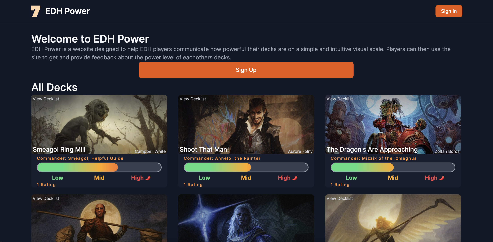

## EDH Power

Created a full stack Magic the Gathering deck rating website for the EDH Format that allows users to register decks that they have created and easily survey other players for feedback about how powerful their decks are.

The frontend was built using Next.js and TailwindCSS. The website is hosted on Google Cloud via Storage Bucket and SSL. The backend is deployed using Azure with Microsoft SQL Server.

## Website
[Click here to view the site!](https://edh-power.web.app/)

## Backend Repo
[Click here to view the code for the backend](https://github.com/AndrewWilborn/edh-power-api)

